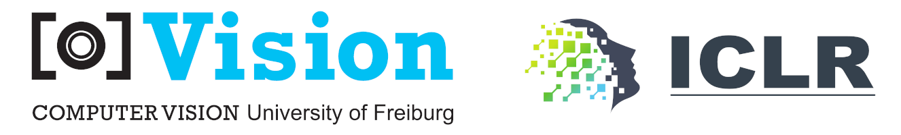

<p align="center">
<a href="https://github.com/lmb-freiburg/ovqa/actions/workflows/build-py310-cpu.yml">
  
</a>
</p>

<div align="center">
<a href="https://arxiv.org/abs/2402.07270">Paper</a>,
<a href="https://iclr.cc/virtual/2024/poster/19102">Poster Session</a>,
<a href="/assets/ovqa_slides_iclr_2024.pdf">Slides</a>,
<a href="https://youtu.be/15bA1WK20tM">Video</a>
</div>

# oVQA: Open-ended Visual Question Answering

This repository contains the official implementation of our [paper](https://arxiv.org/abs/2402.07270)
**"Open-ended VQA benchmarking of Vision-Language models by exploiting Classification datasets and their semantic hierarchy"**
accepted to ICLR 2024 as Spotlight paper.

## News

July 2024: Add example `load_*.py` scripts to enable easier usage of the proposed datasets.

May 2024: Upload slides and poster to prepare for the [ICLR poster session](https://iclr.cc/virtual/2024/poster/19102). Release paper v2 on arxiv with minor fixes.

February 2024: Code release.

- Reproduce oVQA, classical VQA and Retrieval results from our paper.
- Compute metrics: BEM, BLEURT, BertScore, LERC, Llama2-based metric, ExactMatch and Contains (substring matching) with and without synonyms, ngram-based metrics BLEU, METEOR, ROUGE, CIDEr, SPICE, Token-F1.

## Setup

The following document assumes you clone the repository and run all commands in its root directory.

### Python environment

Note: The correct pytorch-cuda version depends on your GPU. 
See [pytorch.org](https://pytorch.org/).
Tested with `python=3.10 pytorch=2.1 cuda=12.1`.

```bash
# git clone
conda create -y -n ovqa python=3.10
conda activate ovqa
conda install -y pytorch torchvision pytorch-cuda=12.1 -c pytorch -c nvidia
pip install -U -r requirements.txt

# Metrics SPICE and METEOR require java 11. Either install system-wide or with conda:
conda install -y -c conda-forge openjdk=11

# optionally install editable
pip install -e .

# # note: for other cuda versions than 12.1 you need a different version of AutoGPTQ, e.g. for 11.8:
# pip install auto-gptq --extra-index-url https://huggingface.github.io/autogptq-index/whl/cu118/
```

In case of version problems try installing from the
frozen pip requirements file `etc/frozen_pip_requirements.txt`
or the frozen conda environment file `etc/frozen_conda_environment.yml`

### Notes

Many of our scripts cache their results. The `view_results_*.py` cache them directly in the respective output folder. Clip embeddings are cached by default in `~/.cache/ovqa`. So if you modify logic, make sure to delete old caches or disable caching via the respective flags.

Also, we are relying on our own repositories via pip requirements:
[typedparser](https://github.com/simon-ging/typedparser),
[packg](https://github.com/simon-ging/packg),
[visiontext](https://github.com/simon-ging/visiontext)

Depending on what you want to do - or if you run into problems with those packages -
you might want to install them as editable source packages
instead of pip site-packages. For example:

```bash
pip uninstall -y visiontext
git clone https://github.com/simon-ging/visiontext.git ../visiontext
pip install -e ../visiontext
python -c 'import visiontext; print(visiontext.__file__)'
# The last line should print the path to the cloned source code.
```

### Setup the paths

View the default paths by running `python print_paths.py`

You have following options to change those paths (1 or 2 are the recommended ways to do it):

1. Export environment variables in your bashrc file. Make sure to restart terminal / IDE / your machine.
2. Create a file named `.env` to set the variables, by copying the `example.env` file.
3. Use the defaults that are provided and create symlinks.
4. The actual loading of the paths happens in `ovqa/paths.py` and external package `packg/paths.py`
   so you can also change the path logic there.

### Setup datasets

Use the respective `load_*.py` script in the root directory to test and check out the dataset after setting it up.

#### Imagenet

Download validation images and devkit from the 
[ImageNet Homepage](https://www.image-net.org/)
and copy it as follows:

```
data/imagenet1k/
  ILSVRC2012_img_val.tar
  ILSVRC2012_devkit_t12.tar.gz
  ILSVRC2012_devkit_t3.tar.gz
  bboxes/ILSVRC2012_bbox_val_v3.tgz
```

then

```bash
# extract files
cd data/imagenet1k
mkdir -p unsorted_val
tar -xf ILSVRC2012_img_val.tar -C unsorted_val
cd bboxes
tar -xzf ILSVRC2012_bbox_val_v3.tgz
cd ../../..

# # now the folder structure should be
# ILSVRC2012_devkit_t3/
# unsorted_val/
# bboxes/val/

# move the images using the first script:
python imagenet_load_dataset.py
# result:
# val/n15075141/ILSVRC2012_val_00049174.JPEG

# cleanup empty folder
rm -r data/imagenet1k/unsorted_val

# create the squared crop
python imagenet_convert_bbox_data.py 
```

Note: In the label space we renamed two classes to avoid duplicate labels:

- "clip_bench_label" of "class_idx": 744, "old_class_num": 542, "synset": "n04008634"
    to "projectile" instead of "missile"
- "clip_bench_label" of "class_idx": 836, "old_class_num": 574, "synset": "n04355933",
    to "sunglass" instead of "sunglasses"

#### ActivityNet

[Homepage](http://activity-net.org/index.html)

```bash
mkdir -p data/activitynet
cd data/activitynet
# download the activitynet annotations
wget http://ec2-52-25-205-214.us-west-2.compute.amazonaws.com/files/activity_net.v1-3.min.json
cd ../..

# install ffmpeg system-wide or via conda-forge
# install ffmpeg python helper and pytube:
pip install ffmpeg-python pytube


# download existing videos from youtube
pip install pytube
python -m ovqa.cli.download_activitynet
# they will be downloaded to
# data/activitynet/videos/
# some videos will be missing.

# next, run the frame extraction script. if there are corrupt videos, delete them.
python -m ovqa.cli.extract_activitynet_frames --num_workers 4

# compute the list of missing videos. this creates data/activitynet/missing_video_ids.txt
python -m ovqa.cli.check_missing_activitynet

# request the missing videos from the author's (see homepage)
# and copy them to data/activitynet/videos
# now the folder should contain 4926 videos.
ls data/activitynet/videos | wc -l

# run the frame extraction again, to extract the frames for the missing videos.
python -m ovqa.cli.extract_activitynet_frames --num_workers 4 --reload

# copy required frames
python -m ovqa.cli.copy_activitynet_frames

# uncropped_frames/ now holds all frames necessary to run ActivityNet-oVQA.
# the dirs videos/ and uncropped_frames_all/ can now safely deleted

# # final structure required to run the benchmark:
# data/activitynet
#     activity_net.v1-3.min.json
#     frames_uncropped/
#         middleframes_val/
#             ...
#             v_-zZJmRT9udU/frame_0000001394.jpg
```

#### COCO

[Homepage](https://cocodataset.org/)

```bash
mkdir -p data/coco
cd data/coco

wget http://images.cocodataset.org/annotations/annotations_trainval2017.zip
unzip annotations_trainval2017.zip

mkdir images
cd images
wget http://images.cocodataset.org/zips/val2017.zip
unzip val2017.zip
cd ../../..

# # final structure should be
# data/coco
#     annotations/
#         instances_val2017.json
#     images/
#         val2017/
#             000000000139.jpg
#            ...
```

#### OVAD

[Homepage](https://ovad-benchmark.github.io/)

Set up COCO val2017 images to `data/coco/images/val2017` as described in section "COCO" above.
All other required files are already included in this repository.

#### VQAv2

[Homepage](https://visualqa.org/)

Annotations will be automatically downloaded on dataset creation. Setup COCO val2014 images:

```bash
mkdir -p data/coco
cd data/coco
wget http://images.cocodataset.org/zips/val2014.zip
unzip val2014.zip
cd ../..

# # final structure should be
# data/coco/images/val2017/
#     COCO_val2014_000000000042.jpg
#     ...
```

#### GQA

[Homepage](https://cs.stanford.edu/people/dorarad/gqa/index.html)

Setup GQA images:

```bash
mkdir -p data/gqa
cd data/gqa
wget https://downloads.cs.stanford.edu/nlp/data/gqa/images.zip
unzip images.zip
```

### Setup model outputs

We provide all model outputs for all datasets here. Extract them to the `output` folder and run the evaluation script `run_scripts/eval_results.sh` to compute the metrics.

```bash
mkdir -p output
cd output
wget https://lmb.informatik.uni-freiburg.de/projects/ovqa/results/activitynet~val.tar.gz
wget https://lmb.informatik.uni-freiburg.de/projects/ovqa/results/coco~val.tar.gz
wget https://lmb.informatik.uni-freiburg.de/projects/ovqa/results/gqa~balanced_testdev.tar.gz
wget https://lmb.informatik.uni-freiburg.de/projects/ovqa/results/imagenet1k-square~val.tar.gz
wget https://lmb.informatik.uni-freiburg.de/projects/ovqa/results/imagenet1k~val.tar.gz
wget https://lmb.informatik.uni-freiburg.de/projects/ovqa/results/retrieval~activitynet~val.tar.gz
wget https://lmb.informatik.uni-freiburg.de/projects/ovqa/results/retrieval~coco~val.tar.gz
wget https://lmb.informatik.uni-freiburg.de/projects/ovqa/results/retrieval~imagenet1k-square~val.tar.gz
wget https://lmb.informatik.uni-freiburg.de/projects/ovqa/results/retrieval~imagenet1k~val.tar.gz
wget https://lmb.informatik.uni-freiburg.de/projects/ovqa/results/vqav2~val.tar.gz
for f in $(ls); do echo $f; tar -xzf $f; done
cd ..
```

### Setup model checkpoints

Model checkpoints from salesforce-lavis and huggingface will download automatically
into `$TORCH_HOME` and `$HF_HOME` respectively.
Other model setups are described below.

#### LLaVA-7B-v0

Download LLaVA-7B-v0 based on Vicuna-7B-v0 as
[explained here](https://github.com/haotian-liu/LLaVA/blob/main/docs/MODEL_ZOO.md#legacy-models-delta-weights).
Note that our Llava implementation is based on the author code state at beginning of July 2023.

Full explanation:

1. As described [on huggingface](https://huggingface.co/docs/transformers/main/model_doc/llama)
   fill out [this form](https://docs.google.com/forms/d/e/1FAIpQLSfqNECQnMkycAp2jP4Z9TFX0cGR4uf7b_fBxjY_OjhJILlKGA/viewform)
   and download the 7B weights like this:

```text
data/pretrained_models/llama1_orig/
  tokenizer.model
  7B/checklist.chk
  7B/consolidated.00.pth
  7B/params.json
```

2. Convert weights to huggingface format:

```bash
python -m transformers.models.llama.convert_llama_weights_to_hf \
  --input_dir data/pretrained_models/llama1_orig --model_size 7B \
  --output_dir data/pretrained_models/llama1_hf/7B
```

3. Apply delta weights to create LLaVA-7B-v0:

```bash
python -m ovqa.models.llava.model.apply_delta \
  --base data/pretrained_models/llama1_hf/7B \
  --target data/pretrained_models/LLaVA/LLaVA-7B-v0 \
  --delta liuhaotian/LLaVA-7b-delta-v0
```

4. Finally your folder should look like this:

```bash
data/pretrained_models/LLaVA/LLaVA-7B-v0/
  added_tokens.json
  config.json
  generation_config.json
  model-00001-of-00003.safetensors
  model-00002-of-00003.safetensors
  model-00003-of-00003.safetensors
  model.safetensors.index.json
  special_tokens_map.json
  tokenizer_config.json
  tokenizer.json
  tokenizer.model
```

#### X2VLM

Below commands will download X2VLM from [here](https://github.com/zengyan-97/X2-VLM)

```bash
mkdir -p data/pretrained_models/x2vlm
cd data/pretrained_models/x2vlm
wget https://lf-robot-opensource.bytetos.com/obj/lab-robot-public/x2vlm_ckpts_2release/x2vlm_base_1b_vqa.th
wget https://lf-robot-opensource.bytetos.com/obj/lab-robot-public/x2vlm_ckpts_2release/x2vlm_large_1b_vqa.th
wget https://raw.githubusercontent.com/zengyan-97/X2-VLM/main/configs/config_beit2_base.json
wget https://raw.githubusercontent.com/zengyan-97/X2-VLM/main/configs/config_beit2_large.json
cd ../../..
```

Finally your folder should look like this:

```text
data/pretrained_models/x2vlm/
  config_beit2_base.json
  config_beit2_large.json
  x2vlm_base_1b_vqa.th
  x2vlm_large_1b_vqa.th
```

#### Test model setup

Import and run inference on all models to see if they are working:

```bash
python check_all_models.py -r
```

### Setup metrics

#### Installing and running BEM metric

BEM requires tensorflow and therefore needs to run in a separate environment and GPU.
Install, and start the server.
Then, from the original environment, query the server.
If the server is not running on the same host as the client,
you will need to change "localhost:5000" to the appropriate address.

```bash
conda deactivate
conda env remove -n bem -y
conda create -n bem python=3.10 -y
conda activate bem
pip install --upgrade pip
pip install tensorflow[and-cuda]==2.14
pip install tensorflow-text==2.14 scipy flask
# check if tensorflow can see the GPU
python -c "from tensorflow.python.client import device_lib; print(device_lib.list_local_devices())"
# start the BEM metric server
python -m ovqa.metrics.bem.bem_server
# run example queries
python -m ovqa.metrics.bem.bem_query
```

## Running

* See `run_scripts/` for running the model evaluation.
* Either run the evaluation yourself or download the model outputs as described 
  in "Setup model outputs" above, then run `run_scripts/eval_results.sh` to compute the metrics. 
* See `assets/tables` for the final numbers to expect.
* Check `load_*.py` if you want to only load the dataset.

## Dev commands

```bash
pip install -U pytest black[jupyter] md-toc
python -m pytest
black -l 100 ovqa tests *.py
python update_toc.py
```

## Licenses

This repository is heavily based on
[LAVIS](https://github.com/salesforce/LAVIS).
Files from lavis are licensed under BSD-3 as noted in the file header.
Our own files are licensed under Apache-2.0.
Other files are licensed as described in either the file header itself,
or in the respective folder or parent folder in a `README.md`, `LICENSE` or `__init__.py` file.

## Acknowledgements

Please refer to our paper's acknowledgement section.
Additionally we would like to acknowledge:

- Creators of the datasets we used in our work: ImageNet, ActivityNet, COCO, OVAD, VQAv2, GQA.
  Homepages are linked in this document, section `Setup datasets`.
- https://github.com/salesforce/LAVIS for providing the codebase for our library, as well as BLIP model family weights and code.
- https://github.com/zengyan-97/X2-VLM for the X2-VLM model and code.
- https://github.com/haotian-liu/LLaVA for the LLaVA model and code.
- https://github.com/mlfoundations/open_clip for the OpenCLIP model and code.
- https://llama.meta.com/ for LLAMA and LLaMA-2 models.
- https://huggingface.co/ for providing a platform and code for easy access to many models.
- https://huggingface.co/TheBloke/ for providing quantized versions of LLaMA and LLaMA-2 models.
- https://github.com/AutoGPTQ/AutoGPTQ for code to run quantized LLMs.
- https://rajpurkar.github.io/SQuAD-explorer/ for the implementation of various text metrics.
- https://github.com/UKPLab/sentence-transformers for code and models to create sentence embeddings.
- https://github.com/Tiiiger/bert_score for their implementation of the BERTScore metric.
- https://github.com/lucadiliello/bleurt-pytorch for their implementation of the BLEURT metrics in PyTorch.
- https://tfhub.dev/google/answer_equivalence/bem for the BEM metric.
- https://github.com/anthonywchen/MOCHA for the LERC metric and MOCHA dataset.
- https://github.com/allenai/allennlp for the codebase that LERC runs on.
- https://github.com/salaniz/pycocoevalcap for their implementation of various text metrics.
- Everyone else in the Python, Conda, PyTorch, jupyter and general open-source community whose code we used as dependencies.

## Citation

```bibtex
@inproceedings{gingbravo2024ovqa,
  title={Open-ended {VQA} benchmarking of Vision-Language models by exploiting Classification datasets and their semantic hierarchy},
  author={Simon Ging and Maria Alejandra Bravo and Thomas Brox},
  booktitle={The Twelfth International Conference on Learning Representations},
  year={2024},
  url={https://arxiv.org/abs/2402.07270}
}
```

